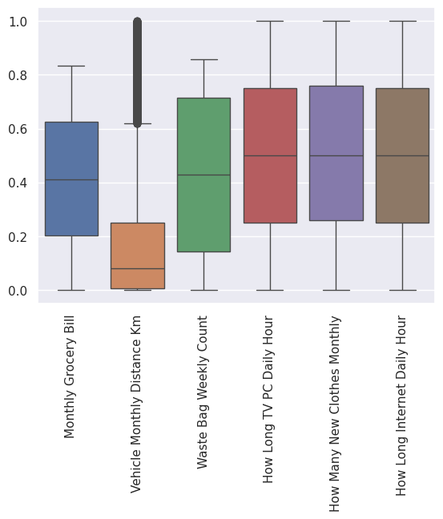
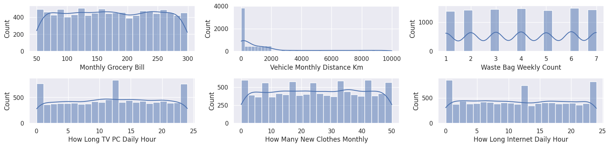
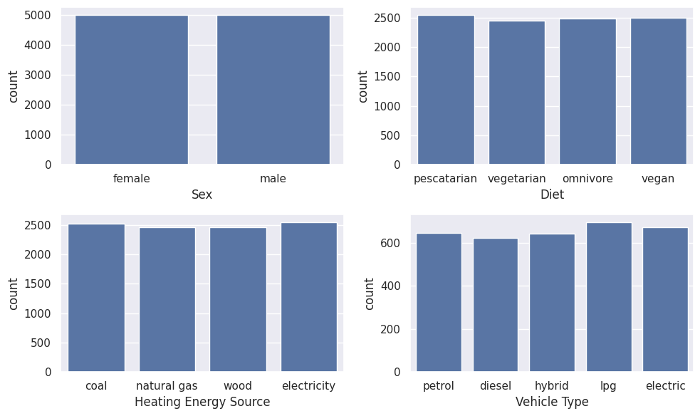
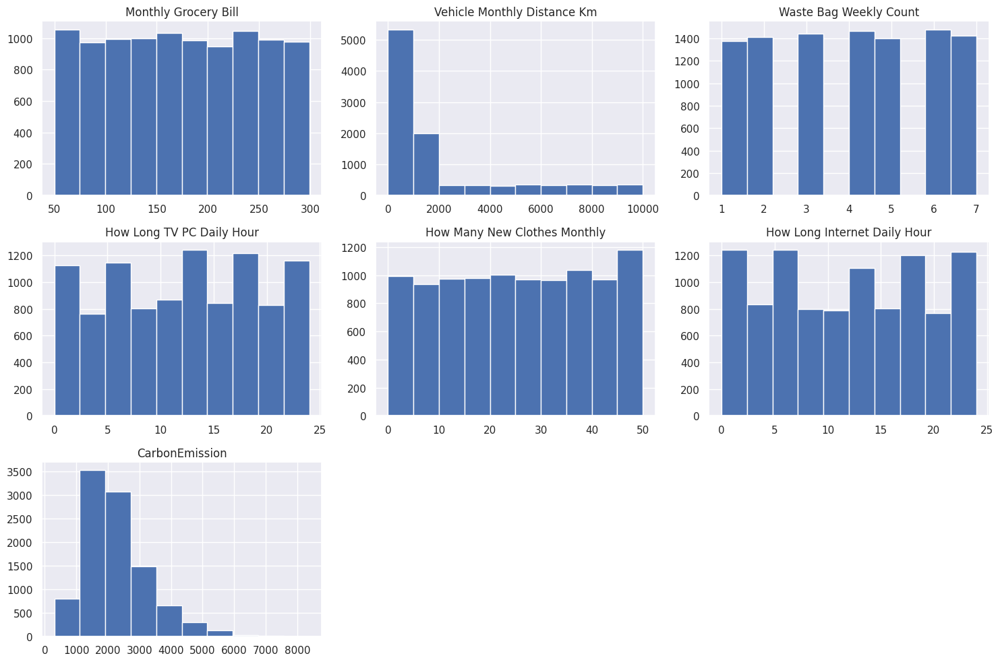
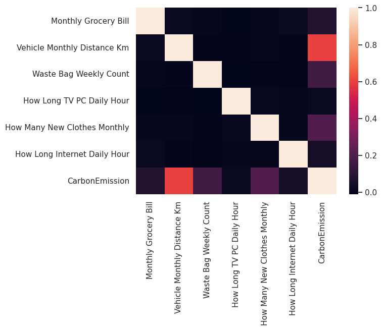
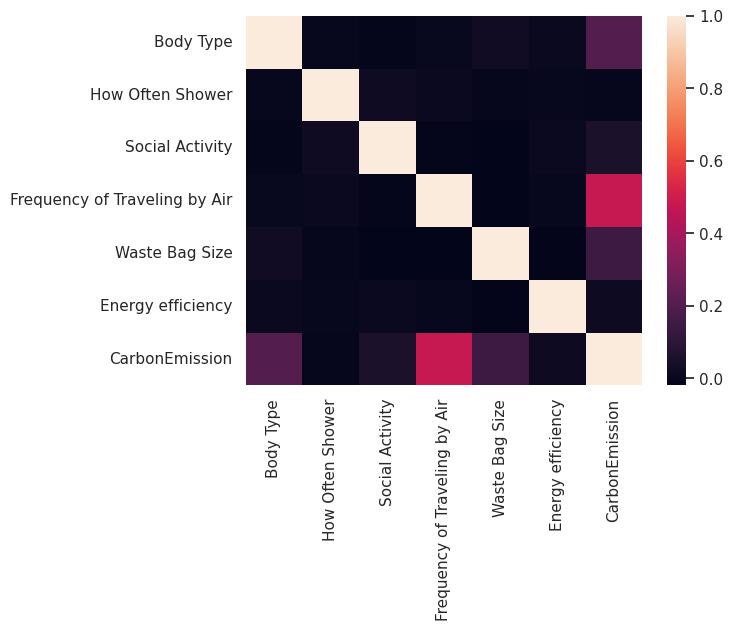
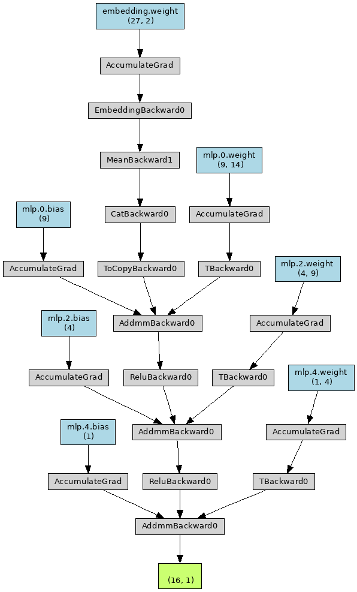
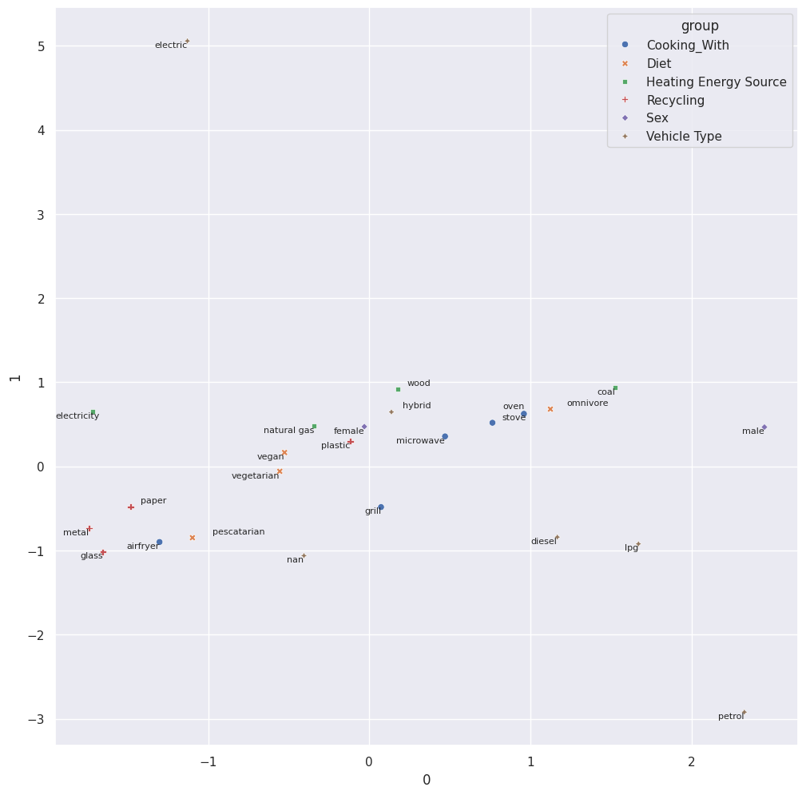

# Laporan Proyek Machine Learning - Rahmatulloh Daffa Izzuddin Wahid

## Domain Proyek

Dewasa ini banyaknya emisi karbon kian menjadi masalah, [laporan tahunan *National Oceanic and Atmospheric Administration* (NOAA)](https://www.noaa.gov/news-release/greenhouse-gases-continued-to-increase-rapidly-in-2022) yang dirilis tahun 2023 menyatakan rata-rata global karbon di atmosfer pada 2022 sebesar 417 ppm, hal ini meningkat 2.13 ppm dari tahun sebelumnya. Tentu saja ini merupakan hal yang mengkhawatirkan, mengingat konsentrasi gas karbon di atmosfer dapat menimbulkan efek rumah kaca yang berujung pada pemanasan global. Menurut [rilis NOOA yang lain](https://gml.noaa.gov/aggi/aggi.html), indeks gas rumah kaca tahunan (AGGI) per tahun 2022 telah mencapai angka 1.49 atau 49% melebihi ambang batas tahun 1990.

Rilis yang dipublikasikan oleh CSS University of Michigan yang berjudul [Carbon Footprint Factsheet](https://css.umich.edu/publications/factsheets/sustainability-indicators/carbon-footprint-factsheet) menyebutkan bahwa rata-rata rumah tangga menghasilkan setidaknya 48 metrik ton CO2 per tahunnya. Rilis yang sama juga menyebutkan 3 sumber penymbang emisi karbon, diantaranya:

- **Makanan** — sebagian besar emisi dihasilkan dari proses produksi dan transportasi makanan.
- **Energi** — penggunaan listrik dan residu hasil penggunaan peralatan rumah tangga seperti kulkas, AC, dan pemanas.
- **Transportasi** — kegiatan perpindahan rumah tangga dengan menggunakan moda pribadi maupun komersial.

Menurut data yang dirilis oleh Hannah Ritchie and Max Roser dalam laporannya yang berjudul "[Indonesia: CO2 Country Profile](https://ourworldindata.org/co2/country/indonesia)", Indonesia memiliki tingkat emisi rata-rata per orang sebesar 2.6 metrik ton dengan total emisi nasional sebesar 728 juta ton pada tahun 2022, meningkat 112 juta ton dari tahun sebelumnya. Hal ini menjadi yang tertinggi setelah sebelumnya pada 2019 terjadi kenaikan sebesar 56 juta ton.

Pernyataan di atas membuktikan bahwa salah satu sumber utama dari meningkatnya emisi karbon adalah penggunaan individu yang juga semakin masif. Hal ini menyebabkan perlu adanya kegiatan **kuratif** dan **preventif** untuk mengobati kelebihan emisi karbon dan mencegah kehancuran alam akibat pemanasan global.

Salah satu yang dapat dilakukan dan dapat dimulai dari kalangan individu adalah dengan **melakukan perkiraan** terkait seberapa besar emisi karbon yang akan dihasilkan berdasarkan data dan perilaku. Hal ini menjadi penting dengan harapan tiap individu memiliki kesadaran untuk mengurangi — atau bahkan menghilangkan sama sekali — kegiatan yang menghasilkan karbon tinggi. Lebih jauh lagi, hal ini juga dapat menjadi bahan proyeksi dan evaluasi bagi pemangku jabatan untuk mengeluarkan regulasi terkait emisi karbon.

## Business Understanding

### Problem Statements

- Berdasarkan data yang ada, apa fitur yang paling berpengaruh terhadap emisi karbon yang dihasilkan oleh setiap orang?
- Berdasarkan fitur yang ada, bagaimana cara memprediksi emisi karbon yang dihasilkan oleh setiap orang?

### Goals

- Mengetahui fitur yang menjadi sumber utama tingginya emisi karbon
- Membuat model yang dapat melakukan prediksi emisi karbon yang dihasilkan

### Solution statements

Masalah yang akan diselesaikan merupakan kasus **regresi** karena diperlukan untuk membuat perkiraan dalam lingkup kontinyu, sehingga solusi yang dapat diajukan antara lain:

- Membuat model menggunakan *multi layer perceptron (MLP)* dengan target error absolute sebesar 2% dari rentang data.
- Merepresentasikan nilai kontribusi data nominal dengan embedding.
- Mengukur keberhasilan model dengan membandingkan nilai MSE, MAE, dan RMSE.
- Memanfaatkan *early stop* untuk menghindari overfitting

## Data Understanding

Dataset yang digunakan diambil dari kaggle, berisi 10000 data dengan 20 fitur yang dibuat secara sitesis berdasarkan perhitungan yang sedemikian rupa.

Laman kaggle dataset: [Individual Carbon Footprint Calculation](https://www.kaggle.com/datasets/dumanmesut/individual-carbon-footprint-calculation)

### Variabel-variabel pada dataset "Individual Carbon Footprint Calculation"

Deskripsi ini diambil dari deskripsi pada laman kaggle dataset [Individual Carbon Footprint Calculation](https://www.kaggle.com/datasets/dumanmesut/individual-carbon-footprint-calculation)

- Body Type: Body type.
- Sex: Gender.
- Diet: Diet.
- How Often Shower: Frequency of showering
- Heating Energy Source: Residential heating energy
- Transport: Transportation preference.
- Vehicle Type: Vehicle fuel type.
- Social Activity: Frequency of participating in social activities.
- Monthly Grocery Bill: Monthly amount spent on groceries, in dollars.
- Frequency of Traveling by Air: Frequency of using aircraft in the last month.
- Vehicle Monthly Distance Km: The kilometers traveled by vehicle in the last month.
- Waste Bag Size: Size of the garbage bag
- Waste Bag Weekly Count: The amount of garbage thrown away in the last week.
- How Long TV PC Daily Hour: Daily time spent in front of TV or PC.
- How Many New Clothes Monthly: Number of clothes purchased monthly.
- How Long Internet Daily Hour: Time spent on the Internet daily.
- Energy efficiency: Whether or not you care about purchasing energy efficient devices.
- Recycling: The wastes it recycles.
- Cooking_With: Devices used in cooking
- CarbonEmission: Dependent variable, total carbon emissions.

### EDA

#### Mendeteksi dan menindaklanjuti missing values

Hasil deteksi nilai nol dan NaN adalah sebagai berikut:

|      | column                       |  nan | zero |
| ---: | :--------------------------- | ---: | ---: |
|    0 | Vehicle Type                 | 6721 |    0 |
|    1 | Vehicle Monthly Distance Km  |    0 |   32 |
|    2 | How Long TV PC Daily Hour    |    0 |  387 |
|    3 | How Many New Clothes Monthly |    0 |  189 |
|    4 | How Long Internet Daily Hour |    0 |  432 |

Hasil tersebut menunjukkan bahwa ada banyak nilai NaN pada kolom `Vehicle Type` dan juga nilai 0 pada kolom lainnya. Sebelum ditindaklanjuti perlu dilihat terlebih dahulu apakah nilai tersebut adalah nilai yang hilang ataukah memiliki arti tertentu.

Observasi hubungan antara kolom `Vehicle Type` dan `Transport` menunjukkan bahwa nilai NaN pada `Vehicle Type` hanya muncul ketika `Transport` yang digunakan adalah "public" atau "walk/bicycle". Hasil observasi tersebut dapat disimpulkan bahwa nilai NaN pada `Vehicle Type` berarti orang tersebut memilih untuk menaiki kendaraan umum atau berjalan, dengan kata lain **tidak memiliki kendaraan**. Karena nilai ini memiliki arti maka tidak perlu dihilangkan.

Nilai 0 pada kolom lainnya masih memiliki arti, karena pada fitur tersebut nilai 0 bisa jadi tidak pernah, atau tidak ada.

#### Mendeteksi dan menindaklanjuti outlier

Hasil deteksi outlier terhadap data yang sudah dinormalisasi adalah sebagai berikut:

Hasil boxplot menunjukkan bahwa outlier hanya ada pada kolom jarak tempuh dan tidak ada pada kolom lainnya. Membuang nilai berdasarkan outlier pada kolom jarak tempuh berpotensi menghilangkan data penting pada kolom lainnya, sehingga tidak perlu dilakukan.

Histogram tersebut menunjukkan kecenderungan data memiliki distribusi yang seragam, kecuali jarak tempuh kendaraan yang right skewed. Hal ini menunjukkan bahwa mayoritas orang bepergian dengan kendaraan dalam jarak mendekati 0 tiap bulannya.

#### Pengelompokan Fitur

Secara umum terdapat 2 jenis data pada dataset ini, yaitu data numerik dan data kategorikal. Data kategorikal dapat dibagi lagi menjadi beberapa jenis data, sehingga komposisi data pada dataset ini adalah sebagai berikut:

1. Numerikal dengan rentang
2. Kategorikal dengan nilai ordinal (level)
3. Kategorikal dengan nilai nominal (semantik)
4. Kumpulan nilai kategorikal (array)

Untuk itu data yang ada perlu dikelompokkan untuk memudahkan proses selanjutnya. Proses pengelompokan menghasilkan beberapa hal sebagai berikut:

- Kolom transport dapat dibuang karena sudah diwakili oleh tipe kendaraan.
- Kolom kategorikal nominal: ['Body Type', 'How Often Shower', 'Social Activity', 'Frequency of Traveling by Air', 'Waste Bag Size', 'Energy efficiency']
- Kolom kumpulan nilai kategorikal: ['Recycling', 'Cooking_With']
- Kolom bernilai nominal: ['Sex', 'Diet', 'Heating Energy Source', 'Vehicle Type']

#### Analisis Univariat

Hasil count plot terhadap data kategori nominal menunjukkan jumlah data yang cenderung seimbang.

Hasil histogram menunjukkan bahwa sebagian besar karbon yang dihasilkan berada pada rentang 1000 hingga 3000. Nilai jarak tempuh kendaraan mayoritas berada pada rentang 0 hingga 2000. Fitur lain cenderung memiliki sebaran yang merata.

#### Analisis Multivariat

Hasil plotting menunjukkan adanya kecenderungan korelasi positif pada semua fitur terhadap jumlah emisi yang dihasilkan. Semua fitur independen tidak berkorelasi secara signifikan dengan fitur lainnya ditandai dengan warna gelap dan nilai korelasi mendekati 0, sehingga PCA tidak akan memberi dampak yang besar.

## Data Preparation

### Mengubah Bentuk Data

Alur perubahan bentuk data adalah sebagai berikut:

1. Mengubah data kategorikal ordinal menjadi numerikal.
2. Mengubah string pada kumpulan data kategorikal menjadi array of string, data ini dianggap sebagai data kateogrikal nominal.
3. Menyatukan semua data nominal menjadi 1 array panjang dalam 1 kolom.

#### Kategorikal Ordinal menjadi Numerik

Hal ini dilakukan untuk memudahkan perhitungan karena nilai tersebut pada awalnya adalah string. Data diurutkan sesuai arti nominal ukuran lalu diubah menjadi bilangan bulat dalam rentang 0 hingga jumlah data. Hasil pemetaan ini diharapkan dapat memberi nilai representatif sesuai dengan nominal data. Hasil korelasi fitur setelah dipetakan adalah sebagai berikut:

Terlihat terdapat hubungan yang cenderung positif pada hampir setiap fitur hasil mapping dengan emisi karbon yang dihasilkan. Hal ini menunjukkan nilai yang dipetakan memiliki nilai yang cukup representatif.

#### Mengubah Kumpulan Data Kategorikal menjadi Array of String

Kolom yang memiliki nilai kumpulan data kategorikal adalah `Recycling` dan `Cooking_With`. Walaupun terlihat seperti list, nilai pada kolom ini masih berupa string. Oleh karena itu perlu diubah menjadi python list yang sebenarnya.

#### Menggabungkan Semua Data Non Numerik

Semua data yang tidak dapat direpresentasikan secara langsung dengan angka dikumpulkan menjadi 1 fitur dengan tipe list. Hal ini dilakukan untuk mengurangi jumlah kolom yang ada dan untuk pembuatan input model. Nilai nominal ini nantinya akan secara otomatis diberi nilai oleh model dengan menggunakan teknik embedding.

#### Hasil Akhir Data

Setelah proses preparasi kolom dataset yang dihasilkan adalah sebagai berikut:

|    # | Column                        | Non-Null Count |  Dtype |
| ---: | ----------------------------- | -------------: | -----: |
|    0 | factor                        | 10000 non-null | object |
|    1 | Body Type                     | 10000 non-null |  int64 |
|    2 | How Often Shower              | 10000 non-null |  int64 |
|    3 | Social Activity               | 10000 non-null |  int64 |
|    4 | Monthly Grocery Bill          | 10000 non-null |  int64 |
|    5 | Frequency of Traveling by Air | 10000 non-null |  int64 |
|    6 | Vehicle Monthly Distance Km   | 10000 non-null |  int64 |
|    7 | Waste Bag Size                | 10000 non-null |  int64 |
|    8 | Waste Bag Weekly Count        | 10000 non-null |  int64 |
|    9 | How Long TV PC Daily Hour     | 10000 non-null |  int64 |
|   10 | How Many New Clothes Monthly  | 10000 non-null |  int64 |
|   11 | How Long Internet Daily Hour  | 10000 non-null |  int64 |
|   12 | Energy efficiency             | 10000 non-null |  int64 |
|   13 | CarbonEmission                | 10000 non-null |  int64 |

### Pembuatan Dataset

#### Tokenizing data nominal

Tokenizer diperlukan untuk mengubah data nominal menjadi numerik namun masih tidak memiliki arti. Tiap data nominal akan petakan pada nomor tertentu yang nantinya akan diproses oleh embdding. Nomor ini tidak akan berubah selama menggunakan tokenizer yang sama. Proses ini sama seperti tokenizing pada NLP

#### Pembagian data latih dan data uji

Data dibagi menjadi data latih dan data uji dengan komposisi 80:20. Data diambil secara random dari 10000 data yang ada dengan hasil akhir 8000 data latih dan 2000 data uji.

## Modeling

Model yang digunakan pada masalah ini adalah MLP, model ini dipilih karena kemampuannya untuk bisa menyesuaikan diri secara otomatis dengan skema backpropagation. Model MLP yang dibuat memiliki 3 layer dengan fungsi aktivasi ReLU pada 2 layer pertama, dan aktivasi linear pada layer output.

Sebagai improvement, sebelum pemrosesan oleh MLP dilakukan pemberian nilai terlebih dahulu untuk fitur nominal yang sudah ditokenisasi. Proses ini dilakukan dengan menggunakan embedding dengan dimensi 2. Hasil akhir embedding selanjutnya dijumlahkan dan menjadi masukan MLP disamping fitur numerik lainnya. Sehingga total input pada model MLP adalah 12 fitur numerik dari dataset ditambah 2 fitur dari hasil embedding.

Arsitektur model secara lengkap dapat dilihat pada grafik berikut:

Percobaan dilakukan dengan menggunakan konfigurasi berikut:

- learning rate: 0.0005
- lr scheduler: decay 0.6 setiap 10 step
- max epoch: 300
- early stop: 6 step

Untuk mencari model terbaik dilakukan pengujian dengan menggunakan beberapa fungsi loss, diantaranya:

- dengan MSE loss
- dengan MAE loss
- dengan MSE + MAE loss

Dengan rincian persamaan fungsi loss sebagai berikut:

$$\begin{align}
MSE(Y, \hat{Y}) &= \frac{1}{n} \sum^n_{i=1}(Y_i-\hat{Y_i})^2 \\
MAE(Y, \hat{Y}) &= \frac{1}{n} \sum^n_{i=1}|Y_i-\hat{Y_i}| \\
f_{mse+mae}(Y, \hat{Y}) &= MSE(Y, \hat{Y}) + MAE(Y, \hat{Y})
\end{align}$$

Hasil training model didapatkan hasil sebagai berikut:

| loss        | step | train_loss |  val_los |
| ----------- | ---: | ---------: | -------: |
| `mse`       |  300 |   0.000279 | 0.000345 |
| `mae`       |  130 |     0.0131 |   0.0141 |
| `mse`+`mae` |   94 |     0.0144 |   0.0159 |

Terlihat model dengan fungsi loss MSE dapat mencapai max epoch tanpa dihentikan oleh early stop, sedangkan model dengan fungsi loss lain berhenti di epoch tertentu. Dari hasil tersebut dapat diasumsikan model dengan loss `mse` merupakan model terbaik karena model dapat konvergen dengan baik. Untuk menguji asumsi ini masih perlu dilakukan evaluasi pada langkah selanjutnya.

## Evaluation

Metrik evaluasi yang digunakan adalah dengan menghitung error MAE berdasarkan rentang data. Pada masalah ini nilai patokan yang menjadi target ($e_t$) adalah 2% dari rentang data. Formula yang digunakan untuk menghitung adalah sebagai berikut:

$$\begin{align}
\epsilon &= \frac{e - e_t}{e_t} \\
&= \frac{MAE(Y, \hat{Y}) - e_t}{e_t}
\end{align}$$

Formula tersebut bekerja dengan cara mencari persentase error hasil prediksi model relatif terhadap target error yang telah ditentukan, semakin kecil nilai error yang dihasilkan menandakan performa model yang semakin baik.

Selain error tersebut juga dilakukan perhitungan skor MSE, MAE, dan RMSE dari setiap hasil prediksi model. Persamaan MSE dan MAE dapat dilihat pada (1) dan (2). Berikut merupakan persamaan RMSE:

$$\begin{align}
RMSE(Y, \hat{Y}) = \sqrt{MSE(Y, \hat{Y})}
\end{align}$$

- **MSE** menghitung rata-rata perbedaan kuadrat antara nilai prediksi dan nilai sebenarnya. Semakin kecil nilainya, semakin baik kualitas estimator.
- **RMSE** menghitung akar kuadrat dari rata-rata perbedaan kuadrat antara nilai prediksi dan nilai sebenarnya. Semakin kecil nilainya, semakin baik akurasi model.
- **MAE** menghitung rata-rata selisih absolut antara nilai prediksi dan nilai sebenarnya. Semakin kecil nilainya, semakin baik akurasi model, terutama jika data berpotensi memiliki outlier.

Dengan target MAE sebesar 0.0174, hasil evaluasi terhadap setiap variasi model adalah sebagai berikut:

| Model               |    MSE |   RMSE |    MAE | Error | Memenuhi target |
| ------------------- | -----: | -----: | -----: | ----: | :-------------: |
| Dengan loss MSE     | 0.0003 | 0.0186 | 0.0136 |  -22% |       ya        |
| Dengan loss MAE     | 0.0004 | 0.0198 | 0.0147 |  -15% |       ya        |
| Dengan loss MSE+MAE | 0.0004 |  0.211 | 0.0154 |  -11% |       ya        |

Dari hasil tersebut dapat disimpulkan bahwa model terbaik adalah model yang dilatih dengan loss MSE karena terbukti memiliki skor evaluasi dan error yang lebih kecil dibanding model dengan fungsi loss lainnya. Model ini menjadi model terbaik untuk memprediksi tingkat emisi karbon yang dihasilkan oleh orang-orang.

Selain menghasilkan prediksi emisi karbon model ini juga dapat memetakan bobot kontribusi relatif setiap fitur nominal. Dari grafik yang dihasilkan dapat dilihat bahwa kendaraan berbahan bakar petrol (penghasil emisi besar) memiliki jarak yang jauh dari kendaraan listrik (penghasil emisi rendah). Hal ini membuktikan bahwa model berhasil memberi bobot relatif pada fitur yang ada.

