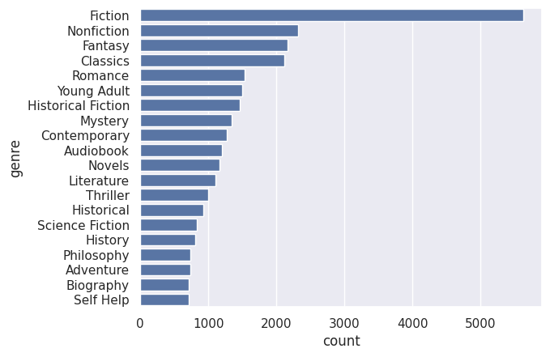
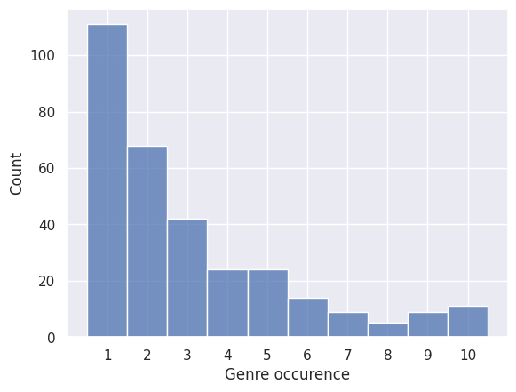
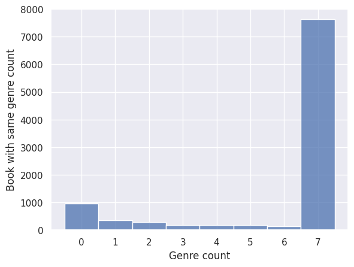
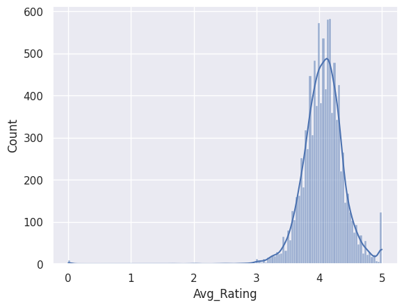
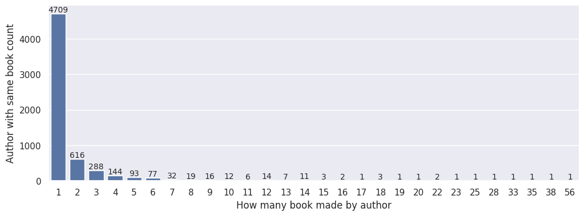
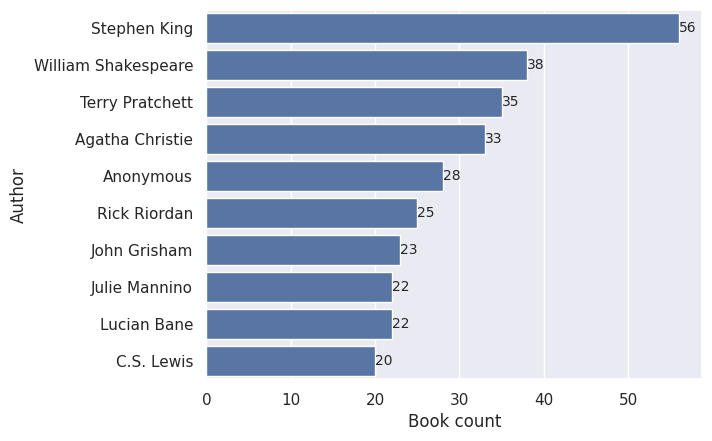
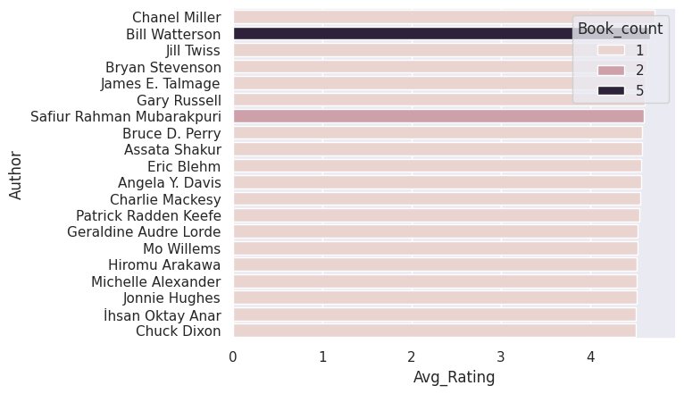

# Laporan Proyek Machine Learning - Rahmatulloh Daffa Izzuddin Wahid

## Project Overview

Di era media audio visual ini, aktivitas membaca seakan menjadi hal yang kuno. Padahal, membaca merupakan cara yang ampuh untuk melatih dan mengaktifkan otak. Bahkan menurut riset berjudul ["A Chapter a Day – Association of Book Reading with Longevity"](https://www.ncbi.nlm.nih.gov/pmc/articles/PMC5105607/), membaca dapat memanjangkan umur hingga 19 bulan. Hal ini secara tidak langsung juga berbanding lurus dengan tingkat kognitif seseorang. 

Menurut [catatan perpusnas](https://databoks.katadata.co.id/datapublish/2021/02/04/kegemaran-membaca-penduduk-indonesia-masuk-kategori-sedang) yang melakukan survei dengan 10200 sample dari 34 provinsi, indeks kegemaran membaca Indonesia naik dengna nilai sebesar 55.74 pada tahun 2020. Rata-rata orang Indonesia membaca 4 kali dalam satu minggu dengan durasi 1 jam 36 menit, dengan jumlah buku dibaca **2 buku per 3 bulan**.

Di tengah momentum ini, sistem rekomendasi buku hadir sebagai solusi untuk menjembatani minat baca masyarakat dengan buku-buku yang tepat. Sistem ini dapat membantu pengguna menemukan buku yang sesuai dengan minat dan kebutuhannya, sehingga dapat mendorong kebiasaan membaca.

Manfaat Sistem Rekomendasi Buku:

- Membantu pengguna menemukan buku yang sesuai: Sistem rekomendasi buku dapat membantu pengguna menemukan buku yang sesuai dengan minat dan kebutuhannya, sehingga pengguna tidak perlu membuang waktu untuk mencari buku yang tidak cocok.
- Meningkatkan minat baca: Sistem rekomendasi buku dapat membantu meningkatkan minat baca masyarakat dengan memberikan rekomendasi buku yang menarik dan relevan.
- Mendukung literasi: Sistem rekomendasi buku dapat membantu mendukung literasi masyarakat dengan menyediakan akses ke berbagai macam buku.

Dengan sistem rekomendasi buku, pengguna dapat dengan mudah menemukan buku yang sesuai dengan seleranya, baik berdasarkan genre, penulis, ataupun tema. Sistem ini dapat membantu pengguna untuk menjelajahi berbagai macam jenis buku dan menemukan bacaan yang menarik dan bermanfaat.

Sistem rekomendasi buku juga dapat membantu pengguna untuk menemukan buku-buku yang mungkin tidak pernah mereka temukan sebelumnya. Hal ini dapat membantu pengguna untuk memperluas wawasan dan pengetahuan mereka.

## Business Understanding

### Problem Statements

- Berdasarkan data yang ada, bagaimana cara memberi rekomendasi buku pada pengguna?
- Berdasarkan data yang ada, fitur apa yang dapat menjadi acuan dalam memberi rekomendasi buku pada pengguna?

### Goals

Menjelaskan tujuan proyek yang menjawab pernyataan masalah:
- Membuat model yang dapat digunakan untuk memberi rekomendasi buku pada pengguna berdasarkan data yang ada.
- Mengetahui fitur yang dapat menjadi acuan dalam memberi rekomendasi pada pengguna

### Solution statemtnts

Masalah sistem rekomendasi ini dapat dilakukan dengan content based filtering dan menjadikan metode tersebut untuk mengambil data dengan collaborative filtering. Hal ini dilakukan karena data yang ada kurang mendukung proses collaborative filtering, sehingga solusi yang diajukan adalah membuat situasi palsu dengan melakukan sampling untuk simulasi pola pengguna. Secara rinci, solusi yang diajukan adalah sebagai berikut:

- Mencari fitur yang dapat digunakan untuk melakukan filtering, fitur ini harus dapat memberi gambaran buku secara jelas.
- Merepresentasikan fitur yang didapat menjadi bentuk numerikal dengan melakukan vektorisai menggunakan TF-IDF
- Melakukan content based filtering untuk mendapatkan n rekomendasi buku teratas
- Simulasi pola pengguna dengan melakukan sampling riwayat bacaan secara acak
- Melakukan pengujian collaborative filtering untuk mendapatkan n rekomendasi buku berdsarkan riwayan bacaan
- Keberhasilan diukur berdasarkan rilis [perpusnas](https://databoks.katadata.co.id/datapublish/2021/02/04/kegemaran-membaca-penduduk-indonesia-masuk-kategori-sedang), yaitu model harus bisa merekomendasikan 10 buku yang setidaknya 2 dari buku tersebut pernah dibaca pada 6 bulan (1 semester) terakhir. Angka 2 dipilih dari 50% jumlah buku yang dibaca selama 6 bulan

## Data Understanding

Dataset yang digunakan diambil dari kaggle, berisi 10000 data dengan 7 fitur. Laman kaggle dataset: [Best Books (10k) Multi-Genre Data](https://www.kaggle.com/datasets/ishikajohari/best-books-10k-multi-genre-data)

### Variabel-variabel pada dataset "Best Books (10k) Multi-Genre Data"

Deskripsi ini diambil dari deskripsi pada laman kaggle dataset [Best Books (10k) Multi-Genre Data](https://www.kaggle.com/datasets/ishikajohari/best-books-10k-multi-genre-data)

- Book - Name of the book. Soemtimes this includes the details of the Series it belongs to inside a parenthesis. This information can be further extracted to analyse only series.
- Author - Name of the book's Author
- Description - The book's description as mentioned on Goodreads
- Genres - Multiple Genres as classified on Goodreads. Could be useful for Multi-label classification or Content based recommendation and Clustering.
- Average Rating - The average rating (Out of 5) given on Goodreads
- Number of Ratings - The Number of users that have Ratings. (Not to be confused with reviews)
- URL - The Goodreads URL for the book's details' page

### EDA

#### Deteksi nilai duplikat

Pengecekan nilai duplikat hanya dilakukan pada kolom judul buku dan penulis saja, karena 2 kolom ini dianggap sudah mewakili keunikan keseluruhan data.

Hasil pengecekan didapatkan terdapat 104 buku yang duplikat sehingga perlu dihapus. Sehingga jumlah data setelah penghapusan ini adalah 9896 data.

#### Observasi genre

Hasil eksplorasi genre menunjukkan terdapat 617 genre unik dengan 20 peringkat teratas kemunculan genre dapat dilihat pada Gambar 1. Dari peringkat tersebut sebagian besar memiliki genre fiksi yang jumlahnya hampir 3 kali lipat buku non fiksi. Selain itu terdapat pula buku dengan genre cenderung fiksi seperti *romance*, *historical fiction*, *novels*, *mystery*, *thriller*, *science fiction*, dan *adventure*.

Gambar 1. Urutan 20 genre dengan kemunculan terbanyak

Eksplorasi terhadap jumlah kemunculan genre pada semua buku menunjukkan bahwa terdapat lebih dari 100 genre yang eksklusif hanya muncul pada 1 buku saja. Genre eksklusif ini tidak dapat dimanfaatkan untuk mencari rekomendasi karena tidak ada buku lain yang memiliki genre serupa, sehingga pada proses rekomendasi buku-buku tersebut dapat diabaikan. Sebaran jumlah kemunculan buku dapat dilihat pada Gambar 2.

Gambar 2. Jumlah kemunculan genre pada semua buku

Sesuai Gambar 3, hasil eksplorasi terhadap jumlah genre pada tiap buku menunjukkan mayoritas buku memiliki 7 genre, jumlah ini sekaligus menjadi jumlah maksimal genre pada buku. Selain itu terdapat hampir 1000 buku yang tidak memiliki genre, buku-buku ini nantinya dapat diabaikan karena tidak akan berpengaruh pada proses rekomendasi berdasarkan genre.

Gambar 3. Sebaran jumlah genre pada setiap buku

#### Observasi rating

Hasil rata-rata, standard deviasi, dan plot menunjukkan bahwa:
- "Rating" memiliki distribusi cenderung normal sesuai hasil histogram pada Gambar 4. Rating memiliki rata-rata mendekati 4 yang cukup mendekati median (50% data)
- "Jumlah rating" memiliki distribusi right skewed ditunjukkan dengan standard deviasi yang sangat tinggi dan titik tengah yang berada pada angka 87373, nilai ini berada pada 80% data. Hasil ini tidak dapat diplot karena sebaran data yang terlalu luas.

Gambar 4. Distribusi rating

Jumlah rating menjadi tolak ukur keakuratan rating pengguna. Semakin banyak pengguna yang memberikan rating maka semakin tinggi tingkat keakuratannya, oleh karena itu diperlukan aturan jumlah minimal pemberi rating untuk menunjukkan validitas rating.

Kondisi nilai mean data berada pada 81% data sehingga nilai ini dianggap terlalu besar jika digunakan sebagai batas bawah rating. Sebagai gantinya maka diambil autran rating yang valid adalah yang memiliki jumlah penilai lebih dari 50% data, atau sekitar 15000 orang.

#### Observasi author

Hasil eksplorasi terhadap author menunjukkan terdapat 6064 author dengan rata-rata author menulis 1,6 buku. Hasil distribusi buku yang ditulis oleh author pada Gambar 5 menunjukkan bahwa mayoritas author hanya menulis 1 buku saja

Gambar 5. Distribusi jumlah buku yang ditulis oleh author

Buku terbanyak ditulis adalah 56 oleh Stephen King, 10 penulis dengan jumlah buku teratas menulis setidaknya 20 buku, sebaran ini dapat dilihat pada Gambar 6.

 

Gambar 6. 20 penulis teratas dengan jumlah buku terbanyak

Gambar 7 menunjukkan 20 author dengan rating rata-rata tertinggi beserta jumlah buku yang dibuat. Hasil eksplorasi menunjukkan sebagian besar author dengan rating tertinggi hanya memiliki 1 buku saja.
   

Gambar 7. 20 Author dengan rating tertinggi

## Data Preparation

### Membuat data berdasarkan genre author

Membuat dataframe barui berisi kumpulan genre buku yang ditulis oleh author, dalam bentuk list boleh berulang serta rating tiap author beserta rating dan rising scorenya. Author yang tidak mencantumkan genre akan diabaikan.

Pembuatan dataframe baru ini bertujuan untuk memudahkan rekomendasi berdasrakan author yang akan dilakukan. Cuplikan 5 data teratas dari dataframe dapat dilihat pada Tabel 1.

Rising score dihitung dengan formula $\frac{rating\_score}{rating\_count}$

Tabel 1. Cuplikan dataFrame genre author
|   ID | Author              | Avg_Rating | Num_Ratings | Book | Rising_Score | Genres                                              |
| ---: | :------------------ | ---------: | ----------: | ---: | -----------: | :-------------------------------------------------- |
|    1 | A. Meredith Walters |       3.93 |       27684 |    1 |     0.295552 | ['Romance', 'New Adult', ... 'Dark']                |
|    2 | A.A. Milne          |      4.384 |      515099 |    5 |    0.0174572 | ['Classics', 'Childrens', ... 'Childrens Classics'] |
|   12 | A.G. Howard         |       3.91 |       61055 |    1 |     0.133176 | ['Fantasy', 'Young Adult', ... 'Fairy Tales']       |
|   15 | A.G. Riddle         |       3.78 |       75138 |    1 |     0.104557 | ['Science Fiction', 'Fiction', ... 'Audiobook']     |
|   18 | A.J. Finn           |       3.96 |      713448 |    1 |    0.0112878 | ['Thriller', 'Mystery', ... 'Crime']                |

### Memberihkan data buku

Beberapa hal yang dilakukan antara lain:
- Membersihkan data buku dengan 1 atau tanpa genre sama sekali
- Membersihkan data buku dengan jumlah penilai kurang dari 50% sebaran data
- Menambahkan kolom rising score dengan nilai $\frac{rating\_score}{rating\_count}$

Hal ini dilakukan untuk mengurangi kompleksitas data dan mengurangi data untuk menghemat memori yang digunakan. Hasil pembersihan ini didapatkan 4948 baris data valid sesuai kondisi di atas.

Tabel 2. Cuplikan dataFrame data buku
|   ID | Book                      | Author        | Genres                                      | Avg_Rating | Num_Ratings | Rising_Score |
| ---: | :------------------------ | :------------ | :------------------------------------------ | ---------: | ----------: | -----------: |
|    0 | To Kill a Mockingbird     | Harper Lee    | ['Classics', 'Fiction', ... 'Historical']   |       4.27 |     5691311 |  0.000966331 |
|    1 | Harry Potter and the ...  | J.K. Rowling  | ['Fantasy', 'Fiction', ... 'Classics']      |       4.47 |     9278135 |            0 |
|    2 | Pride and Prejudice       | Jane Austen   | ['Classics', 'Fiction', ... 'Audiobook']    |       4.28 |     3944155 |   0.00217163 |
|    3 | The Diary of a Young Girl | Anne Frank    | ['Classics', 'Nonfiction', ... 'Holocaust'] |       4.18 |     3488438 |   0.00257867 |
|    4 | Animal Farm               | George Orwell | ['Classics', 'Fiction', ... 'Literature']   |       3.98 |     3575172 |    0.0022727 |

Cuplikan data pada Tabel 2 menunjukkan dataframe hasil memiliki kolom sebagai berikut:

- Book: judul buku (string)
- Author: penulis buku (string)
- Genres: genre buku (list)
- Avg_Rating: rating buku
- Num_Ratings: jumlah orang yang memberi rating
- Rising_Score: skor yang dihitung sesuai rumus yang sebelumnya diberikan

### Inisialisasi TF-IDF vectorizer

TF-IDF vectorizer ini nantinya akan digunakan untuk mengubah data genre menjadi vector. Vectorizer dilatih dengan data genre pada data buku dan nantinya akan diaplikasikan pada genre author dan genre bebas.

## Modeling

Pemodelan dilakukan dengan memanfaatkan vektor hasil TF-IDF dan perhitungan jarak dengan cosine simmilarity. Matriks TF-IDF diambil dari proses sebelumnya (Inisialisasi TF-IDF vectorizer).

Model akan mencari dokumen paling mirip berdasarkan genre dengan cosine similarity lalu mengurutkannya dari yang memiliki kemiripan tertinggi. Hasil pengurutan ini kemudian diurutkan kembali berdsarkan nilai rating dan diambil `n` item teratas sehingga didapatkan rekomendasi berdasarkan rating.

Selanjutnya model mengurutkan kembali hasil berdsarkan rising score, dengan rising score tertinggi berada di atas dan mengecualikan `n` item yang sudah didapatkan pada proses sebelumnya. Hasil pengurutan berdasrkan rising score kemudian diambil `n` item teratas unuk menjadi rekomendasi buku yang sedang naik daun (rising score tinggi).

Terdapat 3 jenis rekomendasi yang masing-masing akan memberikan 2 kelompok rekomendasi berbeda berdasarkan rating dan rising score. Detail cara kerja dan parameter tiap model rekomendasi dijelaskan pada masing-masing pembahasan terkait.

### Rekomendasi buku berdasarkan genre

Dilakukan dengan memilih genre favorit terlebih dahulu, kemudian model akan memproses pilihan genre tersebut dan mengembalikan `n` buku terkait berdasarkan rating dan rising score.

#### Input:
- `genres`: String genre yang diinginkan pengguna.
- `vectorizer`: Objek untuk mengubah genre menjadi vektor numerik.
- `genre_matrix`: Matriks representasi vektor genre buku.
- `book_df`: DataFrame data buku.
- `n`: Jumlah rekomendasi buku yang diinginkan.
- `rising_threshold`: Ambang batas untuk buku yang sedang naik daun.
- `exclude_titles`: Judul buku yang tidak diinginkan dalam rekomendasi.

#### Proses:
1. Membuat salinan DataFrame `book_df`.
2. Mengubah `genres` menjadi vektor target dengan `vectorizer`.
3. Menghitung `similarity_score` antara `genre_matrix` dan vektor target.
4. Menambahkan kolom `similarity` ke DataFrame.
5. Menghilangkan buku dengan judul di `exclude_titles`.
6. Mengurutkan DataFrame berdasarkan `similarity` dan `Avg_Rating`.
7. Mengambil `n` buku teratas berdasarkan `similarity` dan `Avg_Rating`.
8. Mengambil buku yang sedang naik daun dengan `Rising_Score` > `rising_threshold`.
9. Mengurutkan buku naik daun berdasarkan `Avg_Rating`.

#### Output:
- `top_book`: DataFrame `n` buku teratas berdasarkan `similarity` dan `Avg_Rating`.
- `rising_book`: DataFrame `n` buku naik daun dengan `Rising_Score` tinggi.

#### Sampel hasil

Sistem rekomendasi ini baik digunakan ketika awal user menggunakan aplikasi, hal ini karena masih belum ada data kecenderungan user secara jelas seperti pola membaca dan buku faforit.

Tabel 3 dan 4 merupakan sampel hasil rekomendasi dengan parameter berikut:
- `genres`: [Fantasy, Fiction, Young Adult, Magic, Childrens, Middle Grade, Classics]
- `vectorizer`: TF-IDF vectorizer sesuai hasil data preparation
- `genre_matrix`: Matriks TF-IDF genre sesuai hasil data preparation
- `book_df`: Dataframe buku sesuai hasil data preparation
- `n`: 5
- `rising_threshold`: 0.7
- `exclude_titles`: []

Tabel 3. Hasil rekomendasi 5 buku paling sesuai dengan rating teratas

|   ID | Book                                                        | Author       | Rating |
| ---: | :---------------------------------------------------------- | :----------- | -----: |
|   26 | Harry Potter and the Prisoner of Azkaban (Harry Potter, #3) | J.K. Rowling |   4.58 |
|   33 | Harry Potter and the Goblet of Fire (Harry Potter, #4)      | J.K. Rowling |   4.56 |
|    1 | Harry Potter and the Philosopher’s Stone (Harry Potter, #1) | J.K. Rowling |   4.47 |
|   84 | Harry Potter and the Chamber of Secrets (Harry Potter, #2)  | J.K. Rowling |   4.43 |
| 5167 | Half Magic (Tales of Magic, #1)                             | Edward Eager |   3.94 |

Tabel 4. Hasil rekomendasi 5 buku paling sesuai yang sedang naik daun (rising score tinggi)

|   ID | Book                                                                                   | Author                   | Avg_Rating |
| ---: | :------------------------------------------------------------------------------------- | :----------------------- | ---------: |
| 6606 | The Extraordinary Education of Nicholas Benedict (The Mysterious Benedict Society, #0) | Trenton Lee Stewart      |       4.37 |
| 7725 | The Folk of the Faraway Tree (The Faraway Tree, #3)                                    | Enid Blyton              |       4.33 |
| 7734 | The Complete Wreck (A Series of Unfortunate Events, Books 1-13)                        | Lemony Snicket           |       4.33 |
| 7761 | Among the Enemy (Shadow Children, #6)                                                  | Margaret Peterson Haddix |       4.16 |
| 8017 | Double Identity                                                                        | Margaret Peterson Haddix |       4.02 |

### Rekomendasi author berdasrakan author terkait

Rekomendasi dilakukan dengan inputan nama author, kemudian model akan mencari genre author yang bersesuaian dan akan merekomendasikan author lainnya berdasarkan kemiripan genre yang digunakan author tersebut.

#### Input:
- `author_name`: Nama penulis yang diinginkan pengguna.
- `vectorizer`: Objek untuk mengubah genre menjadi vektor numerik.
- `author_matrix`: Matriks representasi vektor genre penulis.
- `author_df`: DataFrame data penulis.
- `n`: Jumlah rekomendasi penulis yang diinginkan.
- `rising_threshold`: Ambang batas untuk penulis yang sedang naik daun.

#### Proses:
1. Membuat salinan DataFrame `author_df`.
2. Mengambil genre dari penulis yang diberikan dengan `author_name`.
3. Mengubah `genres` menjadi vektor target dengan `vectorizer`.
4. Menghitung `similarity_score` antara `author_matrix` dan vektor target.
5. Menambahkan kolom `similarity` ke DataFrame.
6. Menghilangkan penulis dengan nama di `author_name`.
7. Mengurutkan DataFrame berdasarkan `similarity` dan `Avg_Rating`.
8. Mengambil `n` penulis teratas berdasarkan `similarity` dan `Avg_Rating`.
9. Mengambil penulis yang sedang naik daun dengan `Rising_Score` > `rising_threshold`.
10. Mengurutkan penulis naik daun berdasarkan `Avg_Rating`.

#### Output:
- `top_author`: DataFrame `n` penulis teratas berdasarkan `similarity` dan `Avg_Rating`.
- `rising_author`: DataFrame `n` penulis naik daun dengan `Rising_Score` tinggi.

#### Sampel hasil

Sama seperti metode sebelumnya, cara ini cocok untuk pengguna yang baru saja mengunakan aplikasi untuk mencari buku, dengan syarat pengguna tersebut harus sudah mengenal gaya penulisan author terkait. Untuk kasus yang lebih general lebih baik menggunakan metode sebelumnya.

Tabel 5 dan 6 merupakan sampel hasil rekomendasi dengan parameter berikut:
- `author_name`: J.K. Rowling
- `vectorizer`: TF-IDF vectorizer sesuai hasil data preparation
- `author_matrix`: Matriks TF-IDF genre author sesuai hasil data preparation
- `author_df`: Dataframe author sesuai hasil data preparation
- `n`: 5
- `rising_threshold`: 0.7

Tabel 5. Hasil rekomendasi 5 author paling sesuai dengan rating teratas sesuai parameter yang diberikan
|   ID | Author             | Book | Avg_Rating |
| ---: | :----------------- | ---: | ---------: |
| 5197 | Shannon Messenger  |    2 |       4.48 |
| 3184 | Kelly Barnhill     |    1 |       4.12 |
| 4227 | Newt Scamander     |    1 |       3.96 |
| 2644 | Jenny Nimmo        |    2 |       3.87 |
| 3206 | Kennilworthy Whisp |    1 |       3.81 |

Tabel 6. Hasil rekomendasi 5 author paling sesuai yang sedang naik daun (rising score tinggi) sesuai parameter yang diberikan
|   ID | Author               | Book | Avg_Rating |
| ---: | :------------------- | ---: | ---------: |
| 4891 | Robyn Mundell        |    1 |       4.33 |
| 5258 | Sienna Mercer        |    2 |      4.185 |
| 4947 | Rosemary Sutcliff    |    2 |       4.06 |
| 3348 | Laura Gallego García |    2 |      4.025 |
|  916 | Cathy Cassidy        |    2 |        3.9 |

### Rekomendasi berdasarkan riwayat baca

Pengambilan rekomndasi dilakuakn dengan mengambil genre tiap buku yang telah dibaca, mengakumulasikannya, dan mengambil rekomendasi buku berdasarkan hasil akumulasi tersebut.

#### Input:
- `histories`: Daftar judul buku yang telah dibaca pengguna.
- `vectorizer`: Objek untuk mengubah genre menjadi vektor numerik.
- `genre_matrix`: Matriks representasi vektor genre buku.
- `book_df`: DataFrame data buku.
- `n`: Jumlah rekomendasi buku yang diinginkan.
- `rising_threshold`: Ambang batas untuk buku yang sedang naik daun.

#### Proses:
1. Inisialisasi daftar `genres` kosong.
2. Untuk setiap judul buku dalam `histories`, cari genre buku tersebut dalam `book_df`.
3. Tambahkan genre yang ditemukan ke dalam daftar `genres`.
4. Gunakan fungsi `genre_recommend` dengan daftar `genres` yang telah dikumpulkan, `vectorizer`, `genre_matrix`, `book_df`, jumlah rekomendasi `n`, ambang batas `rising_threshold`, dan daftar `histories` sebagai judul buku yang dikecualikan.

#### Output:
- `top_book`: DataFrame yang berisi `n` buku dengan kesamaan genre tertinggi berdasarkan riwayat buku dan rata-rata rating tertinggi.
- `rising_book`: DataFrame yang berisi `n` buku dengan `Rising_Score` di atas `rising_threshold` dan rata-rata rating tertinggi.

#### Sampel hasil

Dibanding rekomendasi menggunakan genre dan author, metode ini memiliki hasil yang lebih dapat diprediksi. Contohnya saja, jika user sudah membaca novel Harry Potter seri 1, 2, dan 3 maka model akan cenderung merekomendasikan buku ke 4 (seri selanjutnya)

Tabel 7 dan 8 merupakan sampel hasil rekomendasi dengan parameter berikut:
- `histories`:
  - Harry Potter and the Prisoner of Azkaban (Harry Potter, #3)
  - Harry Potter and the Chamber of Secrets (Harry Potter, #2)
  - Harry Potter and the Philosopher’s Stone (Harry Potter, #1)
- `vectorizer`: TF-IDF vectorizer sesuai hasil data preparation
- `genre_matrix`: Matriks TF-IDF sesuai hasil data preparation
- `book_df`: Dataframe buku sesuai hasil data preparation
- `n`: 5
- `rising_threshold`: 0.7

Tabel 7. Hasil rekomendasi 5 buku paling sesuai riwayat baca sesuai parameter yang diberikan
|   ID | Book                                                   | Author             | Avg_Rating |
| ---: | :----------------------------------------------------- | :----------------- | ---------: |
|   33 | Harry Potter and the Goblet of Fire (Harry Potter, #4) | J.K. Rowling       |       4.56 |
| 4932 | The Girl Who Drank the Moon                            | Kelly Barnhill     |       4.12 |
| 2939 | Fantastic Beasts and Where to Find Them                | Newt Scamander     |       3.96 |
| 5167 | Half Magic (Tales of Magic, #1)                        | Edward Eager       |       3.94 |
| 2225 | Quidditch Through the Ages                             | Kennilworthy Whisp |       3.81 |

Tabel 8. Hasil rekomendasi 5 buku paling sesuai riwayat baca yang sedang naik daun (rising score tinggi) sesuai parameter yang diberikan
|   ID | Book                                                                                   | Author                   | Avg_Rating |
| ---: | :------------------------------------------------------------------------------------- | :----------------------- | ---------: |
| 6606 | The Extraordinary Education of Nicholas Benedict (The Mysterious Benedict Society, #0) | Trenton Lee Stewart      |       4.37 |
| 7725 | The Folk of the Faraway Tree (The Faraway Tree, #3)                                    | Enid Blyton              |       4.33 |
| 7734 | The Complete Wreck (A Series of Unfortunate Events, Books 1-13)                        | Lemony Snicket           |       4.33 |
| 7761 | Among the Enemy (Shadow Children, #6)                                                  | Margaret Peterson Haddix |       4.16 |
| 8017 | Double Identity                                                                        | Margaret Peterson Haddix |       4.02 |

## Evaluation

Sebelum proses evaluasi perlu dilakukan dulu pembuatan data simulasi pola pengguna. Data dibuat dengan melakukan simulasi pada 3000 user yang masing-masing membaca 4 buku sebagai bahan pengujian. Sampel diambil secara random, sehingga belum tentu dapat menggambarkan keadaan dunia sebenarnya.

Pemilihan angka 4 ini mengacu pada [rilis perpusnas](https://databoks.katadata.co.id/datapublish/2021/02/04/kegemaran-membaca-penduduk-indonesia-masuk-kategori-sedang) yang menyatakan bahwa masyarakat indonesia rata-rata membaca 2 buku selama 3 bulan. Angka 4 disini merupakan akumulasi **jumlah buku selama 1 semester** (6 bulan), ini juga sekaligus meyimulasikan buku yang dihabiskan dalam 1 semester ajaran akademik.

Metrik evaluasi yang digunakan adalah sebagai berikut:

$$\begin{align}
Recall@k &= \frac{\text{jumlah item relevan pada k}}{\text{jumlah item relevan}} \\
Precision@k &= \frac{\text{jumlah item relevan pada k}}{\text{jumlah item pada k}} \\
F1@k &= \frac{Precission@k \times Recall@k}{Precission@k + Recall@k}
\end{align}$$

Pada proses evaluasi, model akan merekomendasikan 10 judul buku berdsarkan riwayat 4 buku yang telah dibaca oleh user sebelumnya. Perhitungan metrik dilakukan dengan skor Recall@K, Precision@K, dan F1@K sesuai rumus di atas.

- $Recall@K$ mengukur proporsi item relevan yang ditemukan dalam K rekomendasi teratas. Ini menunjukkan seberapa banyak item yang benar-benar penting bagi pengguna yang direkomendasikan oleh sistem.

- $Precision@K$ mengukur proporsi rekomendasi teratas yang relevan. Ini menunjukkan seberapa akurat sistem dalam merekomendasikan item yang relevan kepada pengguna.

- $F1@K$ adalah rata-rata harmonik antara Recall@K dan Precision@K. Ini memberikan keseimbangan antara kedua metrik dan merupakan ukuran yang lebih komprehensif tentang kinerja sistem rekomendasi.
  
Sesuai solution statement, target yang diharapkan adalah pada hasil rekomendasi setidaknya terdapat 2 dari 4 buku yang pernah dibaca oleh user.

Setelah dilakukan simulasi dan perhitungan, hasil evaluasi yang didapat dapat dilihat pada Tabel 9.

Tabel 9. Hasil metrik evaluasi
| Metrik    | Skor (mean) |
| :-------- | ----------: |
| recall    |    0.552583 |
| precision |    0.221122 |
| f1        |    0.157925 |

Dari metrik tersebut dapat diambil beberapa hasil sebagai berikut:

- Berdasarkan skor recall: dari total 4 buku yang dibaca user, 2 diantaranya berhasil direkomendasikan oleh sistem rekomendasi
- Berdasarkan skor precision: dari total 10 buku hasil rekomendasi, 2 diantaranya pernah dibaca user
- Berdasarkan skor F1: akruasi prediksi sistem rekomendasi adalah 15%

Kesimpulannya, model telah berhasil merekomendasikan 2 dari 4 buku yang telah dibaca oleh user, hal ini ditandai dengan skor recall 55%. Hal ini membuktikan bahwa model dapat memberi rekomendasi yang sesuai dengan selera pembaca dan juga berhasil memenuhi target pada solution statement.

Selain merekomendasikan buku pada tangga teratas sesuai rating, model juga dapat memberi rekomendasi terkait buku yang kurang terkenal dengan memberikan prediksi sesuai `rising score`. Kedua hal ini dilakukan dengan memanfaatkan kesamaan fitur genre pada setiap buku.